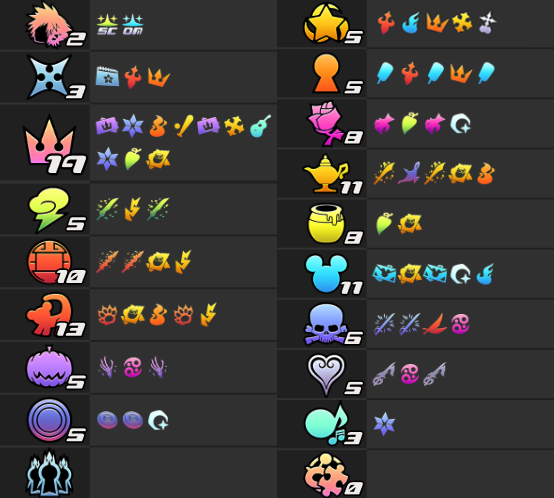
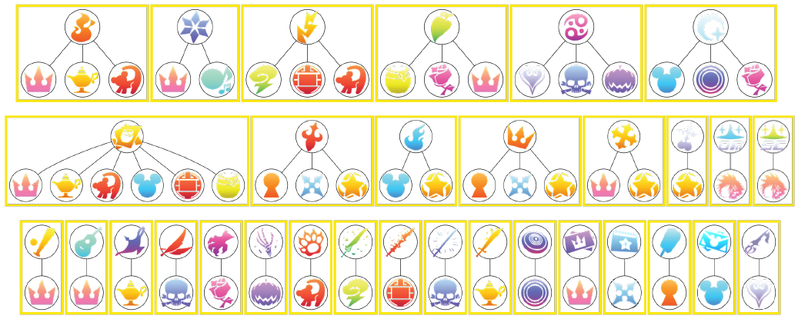

# Path Hints

This hint system aims to leverage knowledge of where items are found in the original game to provide information about
where proofs may reside. This system is loosely inspired by Path to Reward hints from Ocarina of Time Randomizer.

As a baseline, the Shananas style tracking is in place, meaning that once you have collected all the trackable items in
a world, the tracker will indicate the world's completion (with default settings, the world's number turns blue). As
long as the world is not indicated as complete, there is something else "important" there.

Path hints make use of the Ansem Reports in a way to point you toward proof locations. When you collect an Ansem Report,
a hint text will appear, telling you about zero to three proofs, and references a world. As an example, consider this
example hint:

In this example, the Ansem Report you found is telling you about Beast's Castle, and that the items you collect there
will create "paths" toward the Proof of Peace. In this example, you find Fire and Thunder, and since Fire is originally
found in Hollow Bastion, Agrabah, and Pride Lands, and Thunder is originally found in Pride Lands, Olympus Coliseum, and
Land of Dragons, one of those five worlds could have the Proof of Peace.

In this example, if there are no more important checks in Beast's Castle, and that world in the tracker is indicated as
completed, then you know 100% that the Proof of Peace must be in one of those five worlds. If there are items left to
collect, you may not know all the information yet.

Something more interesting can occur with path hints, where you may get information about multiple proofs at once:

In this example, Beast's Castle "is on the path to all lights" meaning all proofs are hinted by the items found in
Beast's Castle. For this example, since Cure and Magnet are the only items found in Beast's Castle, all three proofs
must be in the six worlds above.

Another interesting hint you may receive involves when a world does not hint a proof:

If a hint says that a world "has no path to the light", you know that any item you find in that world cannot point to a
proof.

## Original Locations Cheatsheet

Since the paths are determined by where the items are found in the vanilla game, here's a cheatsheet with what the
randomizer considers "original" locations.

Or alternatively, here's a table based on the items and what worlds they can point toward:

Feel free to save these onto your computer for reference.

## Notable Callouts

* Simulated Twilight Town and Twilight Town share the same original items for purposes of the hints, except for their
  respective visit unlock items.
* Drive Forms' original items are the Drive Forms themselves, for purposes of the hints.
* 100 Acre Wood includes Torn Pages as an original item, in addition to the worlds where the Torn Pages are normally
  located, for purposes of the hints.
* The party member weapons used as keys for locking second visits are attributed to the world where that party member
  exists.
* Puzzles/Synthesis don't have any original items for the hints.
* The Ansem Reports, Proofs, Promise Charm, Munny Pouches, Unknown Disk, Olympus Stone, and Hades Cup Trophy do not
  belong to any particular locations for purposes of the hints.
